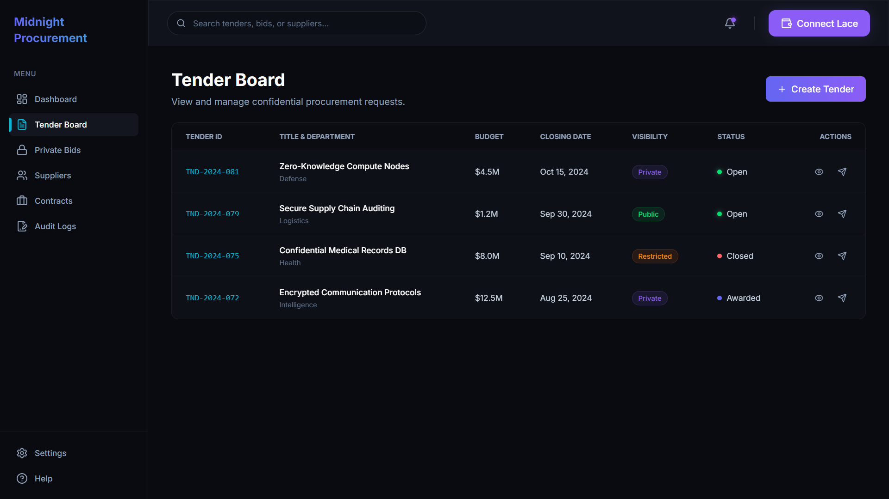
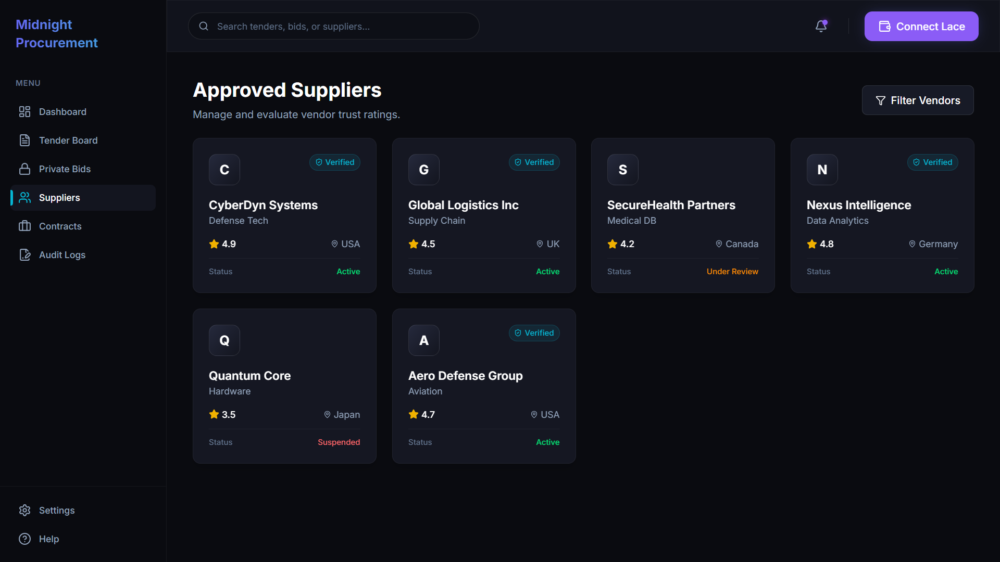

# Confidential Procurement System
> A Confidential Procurement System built on the Midnight Network using Compact smart contracts.

[](https://confidential-procurement-system-p50zjx47w.vercel.app/)
[](https://youtu.be/HqOVxdmK8H0)
[](https://explorer.preprod.midnight.network)
[](https://midnight.network)
[](https://nodejs.org)
[](LICENSE)

---

## 🚀 Live Demo, Video & Repository
- 🌐 **Live Web Application**: [https://confidential-procurement-system-p50zjx47w.vercel.app/](https://confidential-procurement-system-p50zjx47w.vercel.app/)
- 📺 **YouTube Demo Video**: [https://youtu.be/HqOVxdmK8H0](https://youtu.be/HqOVxdmK8H0)
- 📦 **GitHub Repository**: [https://github.com/arisudan-lab/confidential-procurement-system](https://github.com/arisudan-lab/confidential-procurement-system)

---

## 📋 Features & Functionality
- [x] **Fully Functional Privacy dApp**: Meaningful use of Midnight's Zero-Knowledge privacy model for sealed-bid auctions.
- [x] **Live Demo Deployment**: [Live Vercel Application](https://confidential-procurement-system-p50zjx47w.vercel.app/)
- [x] **Demo Video (Lace Wallet + ZK Circuit Call)**: [Watch on YouTube](https://youtu.be/HqOVxdmK8H0)
- [x] **Public GitHub Repository**: [arisudan-lab/confidential-procurement-system](https://github.com/arisudan-lab/confidential-procurement-system)
- [x] **Browser Wallet Integration**: Directly connects to user's Midnight Lace Wallet (`window.midnight.mnLace`).
- [x] **Lace Wallet Connect / Disconnect Lifecycle**: Full session management with event prompts and error handling.

---

## 🛡️ Midnight Privacy Model: What an Observer Learns vs Cannot Learn

### ❌ What an Observer CANNOT Learn (Kept Strictly Private):
1. **Bid Amount**: The exact financial amount bid by the supplier is kept strictly private in the ZK circuit.
2. **Supplier Identity**: The address or identifying data of the bidder submitting the tender proposal.
3. **Proposal Details / Secret**: The proprietary details of the supplier's proposal remain hidden.
4. **Bid Nonce**: Cryptographic entropy generated locally ensuring unique commitments.

### ✅ What an Observer CAN Learn (Disclosed On-Chain Public State):
1. **Tender ID & Organization**: The public details of the tender being bid upon.
2. **Total Bid Count**: The aggregate number of bids received so far.
3. **Tender Status**: Whether the procurement is Open, Closed, or Awarded.
4. **Winning Commitment**: Only upon completion is the hash of the winning bid disclosed publicly.

---

## 🛠️ Contract & Live Deployment Details
| Environment | Location / Address | Verification / Explorer Link |
|---|---|---|
| **Live Web App** | `https://confidential-procurement-system-p50zjx47w.vercel.app/` | [Open Live App](https://confidential-procurement-system-p50zjx47w.vercel.app/) |
| **Demo Video** | `https://youtu.be/HqOVxdmK8H0` | [Watch Video Demo](https://youtu.be/HqOVxdmK8H0) |
| **Preprod Smart Contract** | `0x187ab583926a5ff2e4819242a95edc8dfa8ff784` | [Verify Contract on Midnight Preprod Explorer](https://explorer.preprod.midnight.network) |
| **CI/CD Workflow** | `.github/workflows/ci.yml` | [View GitHub Actions Run](https://github.com/arisudan-lab/confidential-procurement-system/actions) |
| **Repository** | `arisudan-lab/confidential-procurement-system` | [View on GitHub](https://github.com/arisudan-lab/confidential-procurement-system) |

---

## 🔑 Browser Wallet Connector (`window.midnight.mnLace`)
```typescript
// Connect directly to user's browser Midnight Lace Wallet extension
public async connectWallet(): Promise<{ connected: boolean; walletAddress: string; walletName: string }> {
  const provider = this.getBrowserWalletProvider();
  if (!provider) {
    throw new Error("Midnight Lace Wallet extension not detected. Please install and enable the extension.");
  }
  const connectedApi = await provider.connect('preprod');
  const address = await connectedApi.getUnshieldedAddress();
  return { connected: true, walletAddress: address.unshieldedAddress, walletName: provider.name };
}
```

---

## 🚀 Quickstart & Local Installation

1. **Clone the repository**:
   ```bash
   git clone https://github.com/arisudan-lab/confidential-procurement-system.git
   cd confidential-procurement-system
   ```

2. **Set Node version and install dependencies**:
   ```bash
   nvm use 22
   npm install
   ```

3. **Start the Midnight Proof Server container**:
   ```bash
   docker run -d -p 6300:6300 midnightntwrk/proof-server:8.1.0
   ```

4. **Compile the Compact contract**:
   ```bash
   npm run compile
   ```

5. **Start Development Server**:
   ```bash
   npm run dev
   ```

---

## 📸 Platform Screenshots

### Landing Page
.png)

### Dashboard
.png)

### Tender Board


### Approved Supplier


### Contract Deployment
